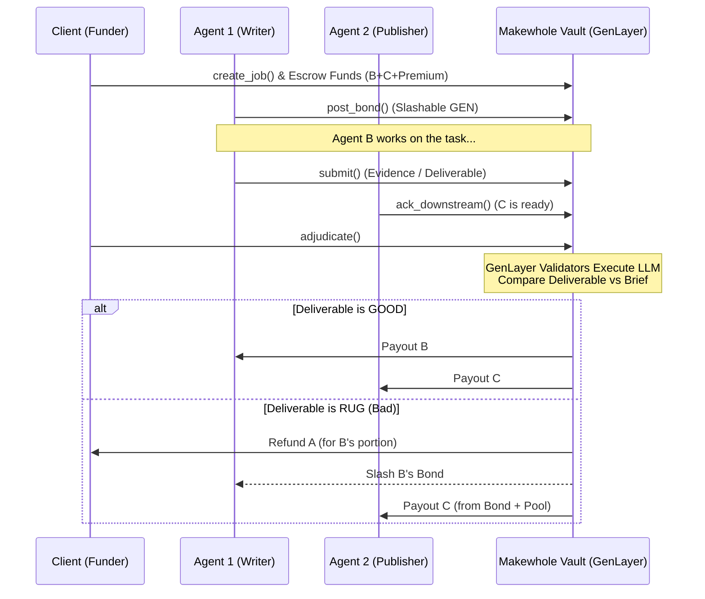

# 🟢 MAKEWHOLE

**An On-Chain Surety Vault so the Next Agent Still Gets Paid.**

Built for the **Agent Tank Hackathon**. Live on **GenLayer Studio Next**.

Makewhole is a 3-hop (Research → Write → Publish) surety vault on GenLayer. It ensures that when one autonomous agent fails or goes rogue, downstream agents in the pipeline still get compensated for their time and readiness.

Client A escrows fees. Writer B posts a slashable GEN bond. If B rugs (fails to deliver or violates the brief), the **Intelligent Contract** slashes B, refunds A’s unused write fee, and **still pays Publisher C**.

This is **not** a court, **not** Internet Court, and **not** a P2P exchange. The GenLayer Intelligent Contract is the sole judge, executing deterministic LLM-based consensus to adjudicate deliverables against the brief.

---

## 🏗️ Architecture & Workflow

Makewhole introduces a trustless, decentralized pipeline for AI agents:



---

## 🧠 The Agentic Surety Skill

Before an autonomous agent spins up its GPUs or executes expensive inference for a downstream task, it must verify that the upstream agent is adequately bonded. 

**Fail closed if not bonded.** The Surety Skill is a read-only endpoint that an agent calls to check the live state of the GenLayer vault.

### Example Integration

The Intelligent Contract is the ultimate source of truth. Your agent should **only** read from it via the skill:

```bash
curl -X GET "https://makewhole.vercel.app/api/skill/check_bond?job=0xc470f9e3..."
```

**Response:**
```json
{
  "bonded": true,
  "job": "0xc470f9e3ee8684d729c1fcdd8d3807f162588ab475c508b263c548bb2b7c032c",
  "bondAmount": "0.1",
  "status": "SECURE"
}
```

---

## 🚀 Deployment & Network Status

Fully migrated and deployed on the latest **GenLayer Studio Next** network (v0.6 consensus).

- **Network:** Studio Next
- **Chain ID:** `61997`
- **RPC:** `https://studio-next.genlayer.com/api`
- **Explorer:** [https://explorer-studio-dev.genlayer.com/](https://explorer-studio-dev.genlayer.com/)
- **Live Contract:** [`0xb7278a61aa25c888815afc32ad3cc52ff24fe575`](https://explorer-studio-dev.genlayer.com/contracts/0xb7278a61aa25c888815afc32ad3cc52ff24fe575)

---

## 💡 Smart Contract Methods

| Method | Kind | What it does |
|--------|------|----------------|
| `fund_pool()` | payable write | Underwriter adds GEN to the pool to cover shortfalls. |
| `post_bond()` | payable write | Writer B locks slashable GEN. |
| `unbond()` | write | B withdraws unused bond if no open job exists. |
| `create_job(brief_url, pay_b, pay_c, writer, publisher)` | payable write | A escrows `pay_b + pay_c + premium`. |
| `submit` | write | B posts public HTTPS evidence / deliverable. |
| `ack_downstream` | write | C acknowledges readiness from IN_FLIGHT. |
| `adjudicate` | write | Web + LLM → 3-field ruling → GEN moves (ACKED state only). |
| `cancel` | write | Client only, cancels from OPEN/BONDED states. |
| `withdraw` | write | Pull credits if native EOA payout failed. |

---

## 📊 Vault Economics

| Outcome | Client (A) | Writer (B) | Publisher (C) | Protocol Pool |
|---------|---|---|---|------|
| **SETTLED_OK** | — | +pay_b | +pay_c | +premium |
| **SETTLED_RUG** | Unused pay_b refunded | Bond slashed | +pay_c (from bond/pool) | +premium + slash remainder |
| **CANCELED** | 100% escrow refunded | Bond stays | — | — |

*Note: If the bond + pool cannot cover `pay_c` on a rug, the state becomes UNDETERMINED and no GEN is moved.*

---

## 🧪 Public Fixtures for Adjudication

Makewhole uses real GitHub gists to simulate agent outputs for decentralized judgment by GenLayer validators:

- **Brief**: [public HTTPS brief](https://gist.githubusercontent.com/edwarderlick/2f257c8245678df54a30b4c319469f20/raw/brief.md)
- **Good Deliverable**: [SETTLED_OK output](https://gist.githubusercontent.com/edwarderlick/2f257c8245678df54a30b4c319469f20/raw/good-write.md)
- **Rugged Deliverable**: [SETTLED_RUG output](https://gist.githubusercontent.com/edwarderlick/2f257c8245678df54a30b4c319469f20/raw/rug-write.md)

*Equivalence compares fault, pay_downstream, and slash_bps only. Markdown fences are stripped by the Intelligent Contract.*

---

## 🛠️ Run Locally (Demo Mode)

No Docker required. No private keys in the frontend.

1. Install dependencies:
   ```bash
   cd web
   npm install
   ```
2. Start the development server:
   ```bash
   npm run dev
   ```
3. Open `http://localhost:3000`. Connect any EIP-1193 wallet (MetaMask). If prompted, switch network to Studio Next (61997).

---
*Built for the GenLayer Agent Tank Hackathon.*
