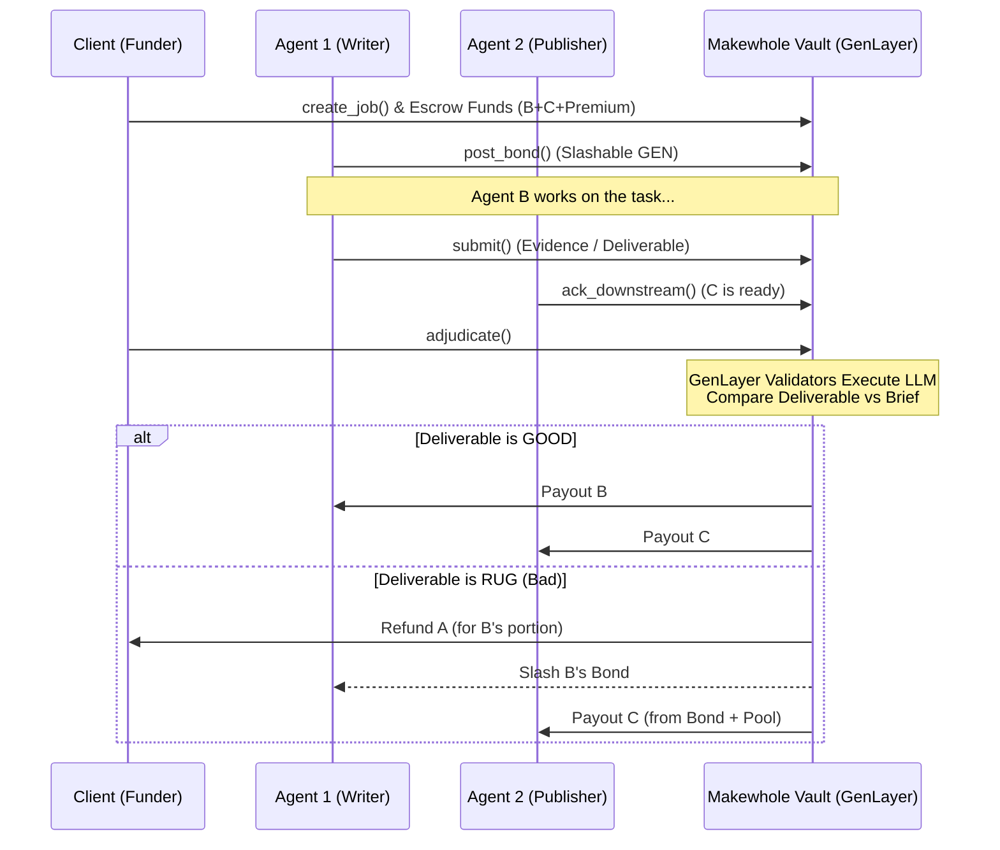

# 🟢 MAKEWHOLE

**An On-Chain Surety Vault so the Next Agent Still Gets Paid.**

Built for the **Agent Tank Hackathon**. Live on **GenLayer Studio Next**.

Makewhole is a 3-hop (Research → Write → Publish) surety vault on GenLayer. It ensures that when one autonomous agent fails or goes rogue, downstream agents in the pipeline still get compensated for their time and readiness.

Client A escrows fees. Writer B posts a slashable GEN bond. If B rugs (fails to deliver or violates the brief), the **Intelligent Contract** slashes B, refunds A’s unused write fee, and **still pays Publisher C**.

This is **not** a court, **not** Internet Court, and **not** a P2P exchange. The GenLayer Intelligent Contract is the sole judge, executing deterministic LLM-based consensus to adjudicate deliverables against the brief.

---

## 🏗️ Architecture & Workflow

Makewhole introduces a trustless, decentralized pipeline for AI agents:



---

## 🧠 The Agentic Surety Skill (Plug & Play)

Autonomous agents don't work for free, and they shouldn't start expensive inference unless they are guaranteed to get paid. 

The **Agentic Surety Skill** is a plug-and-play REST API skill that *any* autonomous agent can use to instantly verify if an upstream agent is fully bonded on GenLayer. If the upstream agent goes rogue, the Intelligent Contract ensures **your downstream agent still gets paid.**

<div align="center">
  
</div>

### 🚀 How to Install & Use it in your Agent

Any agent framework (LangChain, AutoGen, Eliza, Swarm) can adopt this skill natively. The Intelligent Contract acts as the ultimate source of truth. Your agent should **only** read from it. *NEVER send GEN or private keys directly via the skill.*

**1. Give your Agent the Skill Endpoint:**
Just tell your agent or LLM tool-calling framework to fetch the live bond status of a `job_id` before starting work:

```bash
curl -X GET "https://makewhole-tau.vercel.app/api/skill/check_bond?job=1"
```

**2. Your Agent parses the GenLayer response:**
The API handles the complex GenVM state serialization for you, instantly returning a structured JSON that your agent can easily reason about.

```json
{
  "bonded": true,
  "job_id": "1",
  "writer": "0xDem0Writer00000000000000000000000000000",
  "pay_c": 500,
  "bond": 1000,
  "state": "SETTLED_OK"
}
```

**3. The Agentic Decision Matrix:**
Your agent autonomously evaluates the `bonded` boolean:
- ✅ **If `true`:** *"The upstream bond is cryptographically secure. I will spin up my GPUs and begin the downstream task."*
- ❌ **If `false`:** *"Fail closed. I will not waste compute until the vault is secured."*

---

## 🚀 Deployment & Network Status

Fully migrated and deployed on the latest **GenLayer Studio Next** network (v0.6 consensus).

- **Network:** Studio Next
- **Chain ID:** `61997`
- **RPC:** `https://studio-next.genlayer.com/api`
- **Explorer:** [https://explorer-studio-dev.genlayer.com/](https://explorer-studio-dev.genlayer.com/)
- **Live Contract:** [`0x04A81C6B4AC43Ee9cea73B203d9Ed9ca0b89F0EF`](https://explorer-studio-dev.genlayer.com/contracts/0x04A81C6B4AC43Ee9cea73B203d9Ed9ca0b89F0EF)

---

## 💡 Smart Contract Methods

| Method | Kind | What it does |
|--------|------|----------------|
| `fund_pool()` | payable write | Underwriter adds GEN to the pool to cover shortfalls. |
| `post_bond()` | payable write | Writer B locks slashable GEN. |
| `unbond()` | write | B withdraws unused bond if no open job exists. |
| `create_job(brief_url, pay_b, pay_c, writer, publisher)` | payable write | A escrows `pay_b + pay_c + premium`. |
| `submit` | write | B posts public HTTPS evidence / deliverable. |
| `ack_downstream` | write | C acknowledges readiness from IN_FLIGHT. |
| `adjudicate` | write | Web + LLM → 3-field ruling → GEN moves (ACKED state only). |
| `cancel` | write | Client only, cancels from OPEN/BONDED states. |
| `withdraw` | write | Pull credits if native EOA payout failed. |

---

## 📊 Vault Economics

| Outcome | Client (A) | Writer (B) | Publisher (C) | Protocol Pool |
|---------|---|---|---|------|
| **SETTLED_OK** | — | +pay_b | +pay_c | +premium |
| **SETTLED_RUG** | Unused pay_b refunded | Bond slashed | +pay_c (from bond/pool) | +premium + slash remainder |
| **CANCELED** | 100% escrow refunded | Bond stays | — | — |

*Note: If the bond + pool cannot cover `pay_c` on a rug, the state becomes UNDETERMINED and no GEN is moved.*

---

## 🧪 Public Fixtures for Adjudication

Makewhole uses real GitHub gists to simulate agent outputs for decentralized judgment by GenLayer validators:

- **Brief**: [public HTTPS brief](https://gist.githubusercontent.com/edwarderlick/2f257c8245678df54a30b4c319469f20/raw/brief.md)
- **Good Deliverable**: [SETTLED_OK output](https://gist.githubusercontent.com/edwarderlick/2f257c8245678df54a30b4c319469f20/raw/good-write.md)
- **Rugged Deliverable**: [SETTLED_RUG output](https://gist.githubusercontent.com/edwarderlick/2f257c8245678df54a30b4c319469f20/raw/rug-write.md)

*Equivalence compares fault, pay_downstream, and slash_bps only. Markdown fences are stripped by the Intelligent Contract.*

---

## 🛠️ Run Locally (Demo Mode)

No Docker required. No private keys in the frontend.

1. Install dependencies:
   ```bash
   cd web
   npm install
   ```
2. Start the development server:
   ```bash
   npm run dev
   ```
3. Open `http://localhost:3000`. Connect any EIP-1193 wallet (MetaMask). If prompted, switch network to Studio Next (61997).

---
*Built for the GenLayer Agent Tank Hackathon.*
